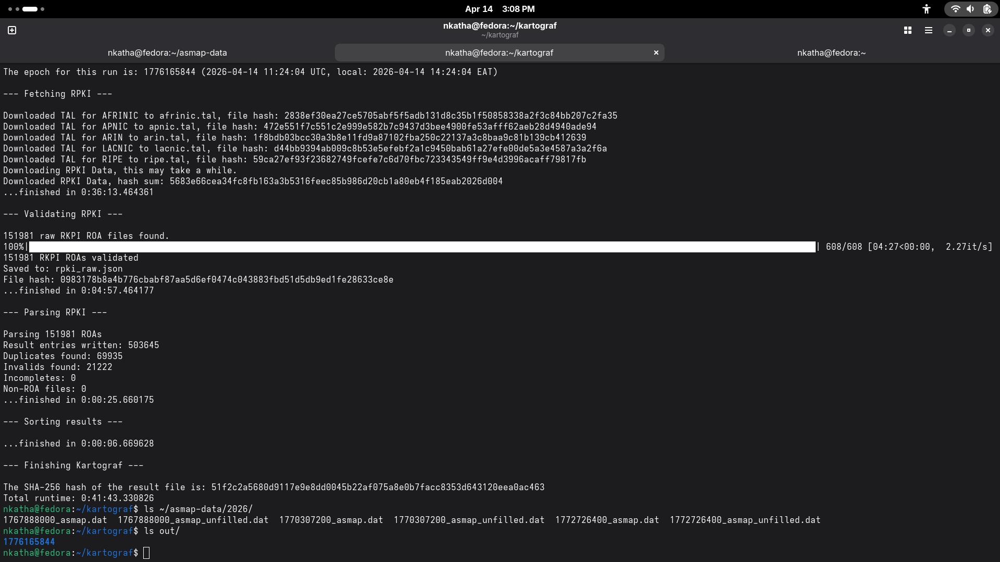

# ASMap Diff Analysis

**Baseline:** `1767888000_asmap.dat` — January 8, 2026 (from asmap-data collaborative run)
**My run:** `1776165844/final_result.txt` — April 14, 2026 (RPKI only, via Kartograf 0.4.13)
**Time gap:** ~96 days

---

## What I Did

Generated a fresh ASMap using Kartograf with RPKI as the only data source (`./run map`). The run took 41 minutes and produced 503,645 prefix-to-ASN entries across all five RIRs (AFRINIC, APNIC, ARIN, LACNIC, RIPE). I then decoded the oldest 2026 collaborative run from asmap-data using `asmap-tool.py decode` and ran `diff` against my output.

### Kartograf Run Output

*Epoch: 1776165844 | Runtime: 0:41:43 | SHA-256: `51f2c2a5680d9117e9e8dd0045b22af075a8e0b7facc8353d643120eea0ac463`*

---

## Results

| Metric | Value |
|---|---|
| Baseline entries | 395,389 |
| My run entries | 503,645 |
| Difference in entry count | +108,256 (+27.4%) |
| IPv4 entries changed | 366,354 |
| IPv6 entries changed | 277,125 |

### RPKI Parsing Stats (My Run)

| Stat | Count |
|---|---|
| Raw ROA files found | 151,981 |
| ROAs validated | 151,981 |
| Duplicates removed | 69,935 |
| Invalid entries | 21,222 |
| Result entries written | 503,645 |

---

## What I Expected

Some divergence was expected — 96 days is long enough for significant BGP churn. The APNIC blog reports roughly 2,000 legitimate IPv4 ASN changes per month, so ~6,000 IPv4 changes over this period would be normal. I also expected my RPKI-only run to differ from the collaborative baseline, since the baseline likely used IRR and Routeviews data in addition to RPKI.

---

## What Surprised Me

**The entry count difference was larger than expected** — 27.4% more entries in my run than the baseline. This is likely because RPKI adoption has grown significantly since January.

**African IPv6 expansion:** The diff output showed many African IPv6 prefixes (`2c0f::/*` range, predominantly AS37xxx ASNs — AFRINIC space) appearing as changed or new, suggesting RPKI deployment in the African region has expanded meaningfully in the intervening months.

**IPv6 scale:** The scale of IPv6 changes (277,125 entries, 2^124 addresses) sounds alarming but is normal — IPv6 address space is enormous and even small routing table changes affect astronomically large address counts.

---

## Where the Tooling Caused Problems

Two friction points worth noting for the proposal:

1. **Format mismatch between Kartograf output and asmap-tool input.** Kartograf produces a plaintext `.txt` file. The `asmap-tool.py diff` command expects compressed `.dat` files. This requires an `encode` step that is not documented clearly in either tool's README. A newcomer following both READMEs independently would not know this.

2. **No coverage check out of the box.** The competency test asks to compare files, but there is no obvious way to know how much of the live Bitcoin network the generated map covers without running `./run cov` separately with a list of known Bitcoin node IPs. The dashboard this project proposes would make this immediately visible.
